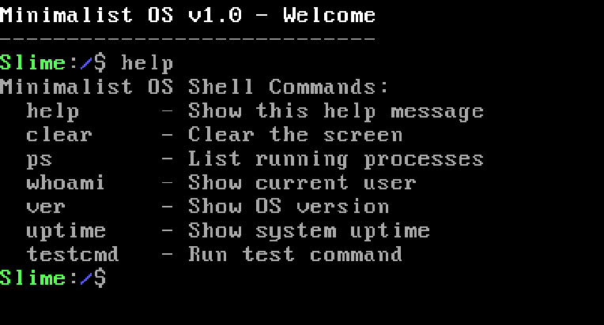

# MinimalistOS

<p align="center">
  
</p>

> A from-scratch operating system built in C and x86 Assembly, targeting i386 (32-bit protected mode). Runs in QEMU with zero external dependencies.

---

## Features

| Category | Highlights |
|----------|-----------|
| **Boot** | Custom 512-byte MBR bootloader, real mode → protected mode transition |
| **Process** | Preemptive round-robin multitasking, context switching at 100Hz, up to 8 processes |
| **Memory** | Bitmap page allocator, identity-mapped paging, bump heap (32KB kernel heap) |
| **Syscalls** | INT 0x80 interface — 35 syscalls for process, file, device, and security ops |
| **Shell** | Interactive command line with built-in commands |
| **Filesystem** | VFS layer + RAMFS in-memory filesystem (create, read, write, seek) |
| **Drivers** | VGA text-mode, PS/2 keyboard (QWERTY/QWERTZ/AZERTY), PIT timer, serial, PCI |
| **ELF Loader** | Parses and executes ELF32 binaries |
| **Security** | UID/GID-based access control, user authentication, ACLs |
| **Power** | Simulated battery, thermal monitoring, CPU throttling |
| **Network** | Device abstraction with NE2000 PCI detection and packet buffering (skeleton) |
| **Monitoring** | System stats, performance metrics, multi-level logging (DEBUG → CRITICAL) |

---

## Quick Start

```bash
make run
```

That's it. Builds the OS and launches it in QEMU.

---

## Prerequisites

- GCC with 32-bit support (`-m32`)
- NASM (Netwide Assembler)
- GNU Make
- GNU ld
- QEMU (`qemu-system-i386`)

<details>
<summary><strong>Arch Linux</strong></summary>

```bash
sudo pacman -S --needed base-devel nasm qemu-full
```
</details>

<details>
<summary><strong>Ubuntu / Debian</strong></summary>

```bash
sudo apt install gcc-multilib nasm make qemu-system-x86
```
</details>

<details>
<summary><strong>Fedora</strong></summary>

```bash
sudo dnf install gcc glibc-devel.i686 nasm make qemu-system-x86
```
</details>

---

## Build Commands

| Command | Description |
|---------|-------------|
| `make` | Build the OS — creates `os.img` |
| `make run` | Build and launch in QEMU with VGA display |
| `make run-debug` | Launch with serial output piped to terminal |
| `make run-vnc` | Headless mode — VNC server on `localhost:1` |
| `make debug` | Launch QEMU with GDB server on port `1234` |
| `make clean` | Remove all build artifacts |
| `make test-all` | Run the automated test suite |
| `make size` | Display kernel size information |

### Test Kernels

Each subsystem has a standalone test kernel:

```bash
make memory-test        # Build memory subsystem test
make interrupt-test     # Build interrupt subsystem test
make keyboard-test      # Build keyboard subsystem test
make device-test        # Build device abstraction test
make network-test       # Build network stack test
make security-test      # Build security subsystem test
make monitor-test       # Build monitoring subsystem test
make power-test         # Build power management test
```

---

## Project Structure

```
.
├── boot/
│   └── debug_boot.asm          # Bootloader (real → protected mode)
│
├── kernel/
│   ├── entry.s                 # Assembly entry point (_start)
│   ├── kmain.c                 # Kernel initialization & main loop
│   ├── idt.c                   # Interrupt Descriptor Table
│   ├── interrupts.s            # ISR/IRQ stubs
│   ├── process.c               # Process table & round-robin scheduler
│   ├── context.c               # Context switching logic
│   ├── context_switch.s        # Context switch (assembly)
│   ├── memory.c                # Page allocator, paging, heap
│   ├── syscall.c               # System call dispatcher (INT 0x80)
│   ├── shell.c                 # Interactive shell
│   ├── string.c                # Freestanding string library
│   ├── log.c                   # Multi-level logging
│   ├── device.c                # Device abstraction layer
│   ├── program_loader.c        # ELF32 loader
│   ├── security.c              # Users, permissions, ACLs
│   ├── monitor.c               # System monitoring
│   ├── power.c                 # Power management (simulated)
│   ├── network.c               # Network stack
│   ├── net_core.c              # Network device registry
│   ├── pci.c                   # PCI bus scanning
│   ├── usermode.c              # Ring 3 transition
│   └── *_test.c                # Per-subsystem test files
│
├── drivers/
│   ├── vga.c                   # VGA text-mode driver
│   ├── keyboard.c              # PS/2 keyboard driver
│   ├── keyboard_intl.c         # International keyboard layouts
│   ├── timer.c                 # PIT timer (100Hz)
│   ├── serial.c                # COM1 serial driver
│   └── net_ne2k.c              # NE2000 NIC skeleton
│
├── fs/
│   ├── vfs_simple.c            # VFS layer
│   └── ramfs.c                 # In-memory filesystem
│
├── include/                    # System headers (stdint, string, etc.)
├── Makefile                    # Build system
├── link.ld                     # Linker script (kernel at 0x8000)
└── os.img                      # Generated bootable disk image (10MB)
```

---

## Architecture

```
┌───────────────────────────────────────────────────────┐
│                     User Shell                        │
├───────────────────────────────────────────────────────┤
│   Security   │   Monitor   │   Power   │   ELF Load  │
├───────────────────────────────────────────────────────┤
│   Process    │   Memory    │   IDT     │   Syscalls   │
├───────────────────────────────────────────────────────┤
│   VGA    │  Keyboard  │  Timer  │  Serial  │   PCI   │
├───────────────────────────────────────────────────────┤
│              Boot → Protected Mode Entry              │
└───────────────────────────────────────────────────────┘
```

---

## Boot Sequence

1. **BIOS** loads bootloader from MBR to `0x7C00` (16-bit real mode)
2. **Bootloader** loads kernel to `0x8000`, sets up GDT, enables protected mode
3. **Entry** (`_start`) initializes segment registers and 32KB stack
4. **kmain()** initializes all subsystems → enables interrupts → launches shell

---

## Limitations

This is an educational OS. Known limitations:

- **No `kfree()`** — heap is bump-only (no memory reuse)
- **RAMFS only** — in-memory filesystem, no real disk I/O
- **Network skeleton** — device abstraction exists, but no real packet transmission
- **Fixed process table** — max 8 processes
- **VGA text mode** — no graphical output
- **No user-space** — everything runs in kernel mode (Ring 0)

---

## References

- [OSDev Wiki](https://wiki.osdev.org/) — Essential OS development reference
- [JamesM's Kernel Development Tutorials](http://www.jamesmolloy.co.uk/tutorial_html/)
- [BrokenThorn Entertainment OS Development Series](http://www.brokenthorn.com/Resources/)

---

## License

Educational use. Contact for commercial licensing.
